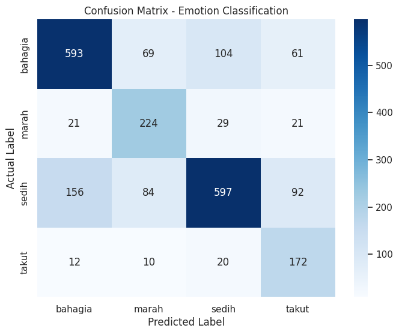
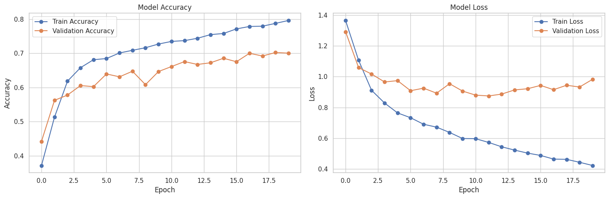
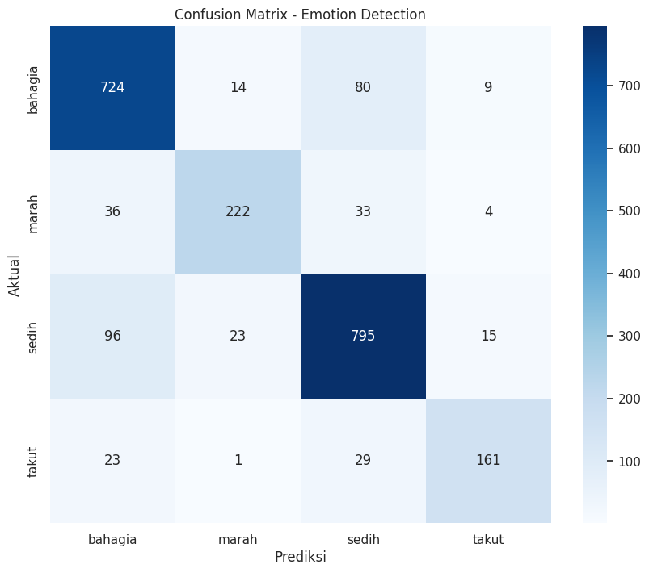
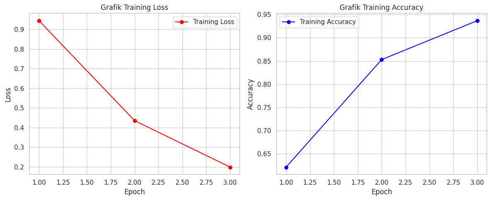
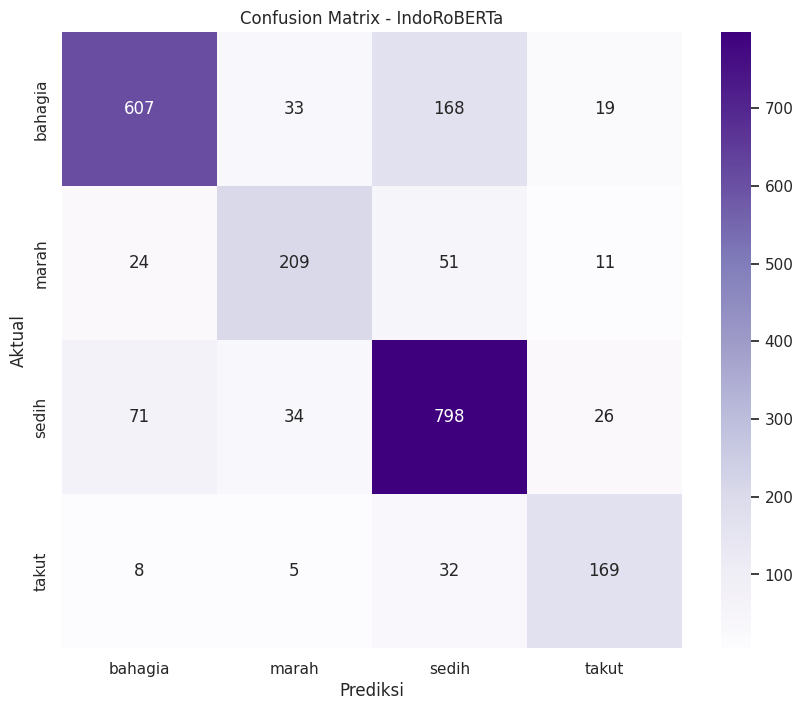
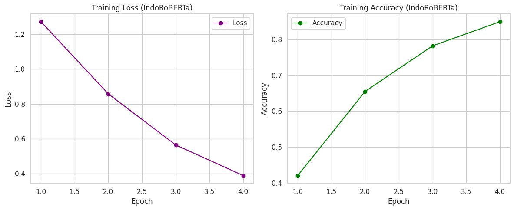
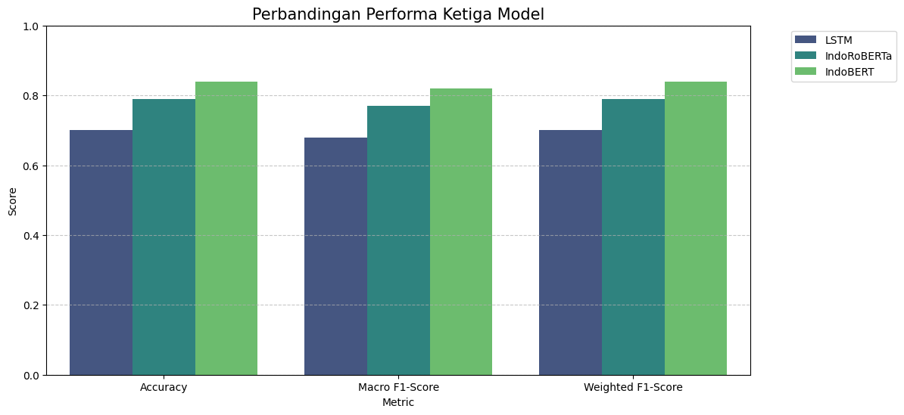
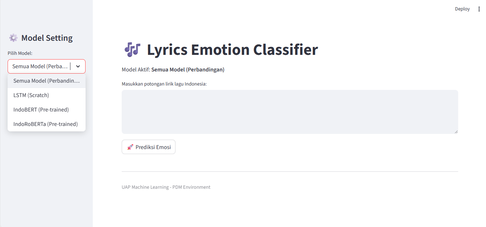
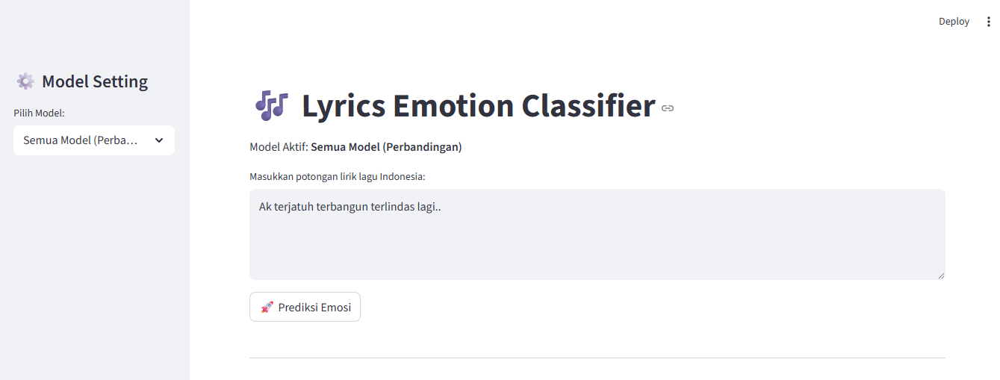
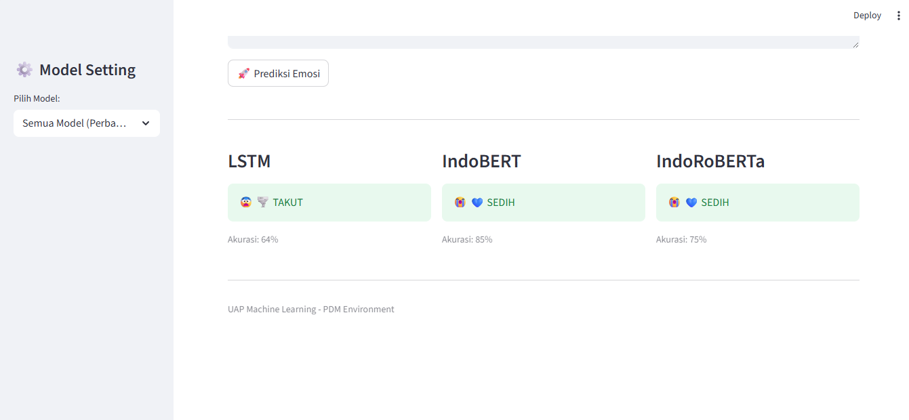

# 🎵 INDONESIAN SONG LYRICS EMOTION CLASSIFICATION

<p align="center">
  
</p>


## 📌 Deskripsi Project

Proyek ini berfokus pada pengembangan sistem **klasifikasi emosi berdasarkan lirik lagu musisi Indonesia** menggunakan pendekatan *Natural Language Processing (NLP)* dan *Deep Learning*. Sistem ini dirancang untuk mengidentifikasi emosi utama yang terkandung dalam lirik lagu, sehingga dapat membantu dalam analisis musik, riset emosi, serta pengembangan aplikasi berbasis teks dan musik.

### 🎯 Latar Belakang

Lirik lagu merupakan bentuk ekspresi emosional yang kuat. Musisi sering menuangkan perasaan seperti kebahagiaan, kesedihan, kemarahan, maupun ketakutan ke dalam kata-kata yang tersusun dalam lagu. Dengan meningkatnya ketersediaan data lirik lagu digital, analisis emosi berbasis teks menjadi bidang yang menarik untuk dikembangkan menggunakan teknik *Machine Learning* dan *Deep Learning*.

Namun, sebagian besar penelitian dan dataset emosi lirik lagu masih berfokus pada bahasa Inggris. Oleh karena itu, proyek ini dikembangkan untuk **bahasa Indonesia**, yang memiliki karakteristik linguistik dan emosional tersendiri.

### 🎯 Tujuan Pengembangan

Tujuan utama dari proyek ini adalah:

* Membangun **model klasifikasi emosi lirik lagu berbahasa Indonesia**.
* Membandingkan performa beberapa model NLP, yaitu **LSTM**, **IndoBERT**, dan **IndoRoBERTa**.
* Mengklasifikasikan emosi lirik lagu ke dalam beberapa kategori emosi dasar manusia.
* Mengembangkan **dashboard interaktif berbasis Streamlit** untuk memudahkan pengguna melakukan prediksi emosi lirik lagu.

---

## 🎭 Kategori Emosi

Model dikembangkan untuk mengklasifikasikan lirik lagu ke dalam empat kelas emosi berikut:

* 😢 **Sedih**
* 😄 **Bahagia**
* 😠 **Marah**
* 😨 **Takut**

---

## 📊 Sumber Dataset

Dataset yang digunakan dalam proyek ini diperoleh dari platform Kaggle.

* **Sumber**: Kaggle
* **Jenis Data**: Lirik lagu musisi Indonesia
* **Jumlah Data**: ± 3.000+ data lirik lagu
* **Bahasa**: Bahasa Indonesia
* **Target**: Label emosi (Sedih, Bahagia, Marah, Takut)

Dataset ini digunakan untuk melatih dan mengevaluasi model klasifikasi emosi berbasis teks.

---

## 🧑‍💻 Preprocessing dan Pemodelan

### 🔹 Preprocessing Data

Tahapan preprocessing yang dilakukan meliputi:

* *Augmentasi data menjadi 11.321 jumlah data
* *Case folding* (mengubah teks menjadi huruf kecil)
* *Text cleaning* (menghapus tanda baca, angka, dan karakter khusus)
* *Tokenization*
* *Stopword removal*
* *Padding & truncation* untuk model berbasis LSTM
* *Tokenizer khusus pretrained model* untuk IndoBERT dan IndoRoBERTa
* *Label encoding* pada kelas emosi

Dataset kemudian dibagi menjadi:

* **Data Latih (Training)**: 80%
* **Data Uji (Testing)**: 20%

---

### 🔹 Model yang Digunakan

#### 1️⃣ Long Short-Term Memory (LSTM)

LSTM merupakan varian dari Recurrent Neural Network (RNN) yang mampu menangkap dependensi jangka panjang dalam data sekuensial seperti teks. Model ini digunakan sebagai pendekatan dasar (*baseline*) dalam klasifikasi emosi lirik lagu.

#### 2️⃣ IndoBERT

IndoBERT adalah model *transformer* yang telah dilatih sebelumnya (*pretrained*) pada korpus bahasa Indonesia. Model ini mampu memahami konteks kata secara bidirectional dan digunakan untuk meningkatkan performa klasifikasi emosi.

#### 3️⃣ IndoRoBERTa

IndoRoBERTa merupakan pengembangan dari arsitektur RoBERTa yang diadaptasi khusus untuk bahasa Indonesia. Model ini diharapkan mampu memberikan performa yang lebih baik dalam memahami nuansa emosional lirik lagu.

---

## 🔍 Hasil dan Analisis

Evaluasi performa model dilakukan menggunakan beberapa metrik klasifikasi, yaitu **Accuracy**, **Precision**, **Recall**, dan **F1-Score**. Evaluasi ini bertujuan untuk membandingkan kemampuan masing-masing model dalam mengklasifikasikan emosi lirik lagu ke dalam empat kelas emosi.

### 📊 Hasil Evaluasi Model

#### 🔹 LSTM

| Emosi   | Precision | Recall | F1-Score | Support |
| ------- | --------- | ------ | -------- | ------- |
| Bahagia | 0.76      | 0.72   | 0.74     | 827     |
| Marah   | 0.58      | 0.76   | 0.66     | 295     |
| Sedih   | 0.80      | 0.64   | 0.71     | 929     |
| Takut   | 0.50      | 0.80   | 0.61     | 214     |

* **Accuracy**: 0.70
* **Macro Average F1-Score**: 0.68
* **Weighted Average F1-Score**: 0.70

### Confusion Matrix



### Grafik Akurasi



Model LSTM mampu menangkap pola sekuensial pada lirik lagu, namun performanya masih terbatas terutama pada kelas dengan distribusi data yang tidak seimbang.

---

#### 🔹 IndoBERT

| Emosi   | Precision | Recall | F1-Score | Support |
| ------- | --------- | ------ | -------- | ------- |
| Bahagia | 0.82      | 0.88   | 0.85     | 827     |
| Marah   | 0.85      | 0.75   | 0.80     | 295     |
| Sedih   | 0.85      | 0.86   | 0.85     | 929     |
| Takut   | 0.85      | 0.75   | 0.80     | 214     |

* **Accuracy**: 0.84
* **Macro Average F1-Score**: 0.82
* **Weighted Average F1-Score**: 0.84

### Confusion Matrix



### Grafik Akurasi




IndoBERT menunjukkan performa terbaik di antara ketiga model. Hal ini disebabkan oleh kemampuannya dalam memahami konteks kata secara dua arah (*bidirectional context*) pada bahasa Indonesia.

---

#### 🔹 IndoRoBERTa

| Emosi   | Precision | Recall | F1-Score | Support |
| ------- | --------- | ------ | -------- | ------- |
| Bahagia | 0.85      | 0.73   | 0.79     | 827     |
| Marah   | 0.74      | 0.71   | 0.73     | 295     |
| Sedih   | 0.76      | 0.86   | 0.81     | 929     |
| Takut   | 0.75      | 0.79   | 0.77     | 214     |

* **Accuracy**: 0.79
* **Macro Average F1-Score**: 0.77
* **Weighted Average F1-Score**: 0.79

### Confusion Matrix



### Grafik Akurasi




IndoRoBERTa memberikan performa yang lebih stabil dibandingkan LSTM, terutama dalam menangkap konteks emosional pada lirik lagu, namun masih berada di bawah IndoBERT.

---

### 📌 Analisis Perbandingan Model

Berdasarkan hasil evaluasi, dapat disimpulkan bahwa:

* **IndoBERT** memberikan performa terbaik dengan accuracy dan F1-score tertinggi.
* **IndoRoBERTa** berada di posisi kedua dengan performa yang cukup stabil.
* **LSTM** memiliki performa terendah, terutama pada kelas emosi dengan jumlah data yang lebih sedikit.

Perbedaan performa ini menunjukkan bahwa model berbasis *transformer* lebih efektif dalam memahami konteks dan nuansa emosi pada lirik lagu dibandingkan model sekuensial tradisional seperti LSTM.

### Tabel Perbandingan Model



---

## 🎛️ Sistem Dashboard Streamlit

Untuk memudahkan penggunaan model, dikembangkan sebuah **dashboard interaktif berbasis Streamlit**.

### ✨ Fitur Dashboard & 🖥️ Tampilan Aplikasi

* Pemilihan model (LSTM / IndoBERT / IndoRoBERTa)



* Input lirik lagu dalam bentuk teks



* Prediksi emosi lirik lagu
* Visualisasi confidence score untuk setiap kelas emosi

  

---

## ⚙️ Langkah Instalasi

### 1️⃣ Software Utama

* Python 3.10+
* Google Colab
* VSCode

### 2️⃣ Instalasi Dependensi

Semua dependensi tersedia pada file `requirements.txt`.

```bash
pip install -r requirements.txt
```

### 3️⃣ Menjalankan Dashboard

```bash
streamlit run app.py
```

---

## 🔗 Link & Resource

* 📓 Notebook Training Model : (https://colab.research.google.com/drive/1rITFdWzcBUpKP5w1zV564t4ySEyRalv_?usp=sharing)
* 📊 Dataset Kaggle : (https://www.kaggle.com/datasets/bytadit/indo-song-emolyric-dataset)

---

## 👤 Biodata

**Nama**: (Muhammad Dava Diansyah) <br>
**NIM**: (202210370311243) <br>
**Program Studi**: Teknik Informatika <br>
**Universitas**: (Universitas Muhammadiyah Malang)

---

## 📝 Kesimpulan

Berdasarkan hasil pengembangan dan evaluasi sistem klasifikasi emosi lirik lagu musisi Indonesia, dapat ditarik beberapa kesimpulan sebagai berikut:

1. Sistem klasifikasi emosi lirik lagu berbahasa Indonesia berhasil dibangun menggunakan pendekatan *Natural Language Processing* dan *Deep Learning* dengan empat kelas emosi, yaitu **sedih**, **bahagia**, **marah**, dan **takut**.

2. Model berbasis *transformer* menunjukkan performa yang lebih unggul dibandingkan model sekuensial tradisional. Hal ini terlihat dari hasil evaluasi di mana **IndoBERT** memperoleh performa terbaik dengan accuracy sebesar **84%** dan weighted F1-score sebesar **0.84**, diikuti oleh **IndoRoBERTa** dan **LSTM**.

3. Model **LSTM** masih mampu menangkap pola sekuensial dalam teks lirik lagu, namun memiliki keterbatasan dalam memahami konteks emosional yang kompleks, terutama pada kelas emosi dengan jumlah data yang lebih sedikit.

4. Keunggulan IndoBERT dan IndoRoBERTa disebabkan oleh kemampuan model *pretrained transformer* dalam memahami konteks kata secara dua arah (*bidirectional context*), yang sangat penting dalam analisis emosi berbasis teks.

5. Implementasi **dashboard Streamlit** berhasil memberikan antarmuka yang interaktif dan mudah digunakan, sehingga sistem klasifikasi emosi ini dapat diakses dan dimanfaatkan secara langsung oleh pengguna non-teknis.

### 🚀 Pengembangan Selanjutnya

Beberapa pengembangan yang dapat dilakukan di masa mendatang antara lain:

* Menambah jumlah data dan variasi emosi untuk meningkatkan generalisasi model.
* Menerapkan teknik *data augmentation* khusus teks berbahasa Indonesia.
* Mengintegrasikan fitur audio (seperti MFCC atau embedding audio) untuk klasifikasi emosi berbasis multimodal.
* Melakukan *hyperparameter tuning* dan eksperimen arsitektur lanjutan untuk meningkatkan performa model.

---

📌 *Project ini dikembangkan sebagai bagian dari ujian praktikum machine learning dan eksplorasi dalam bidang Natural Language Processing dan Deep Learning untuk bahasa Indonesia.*
